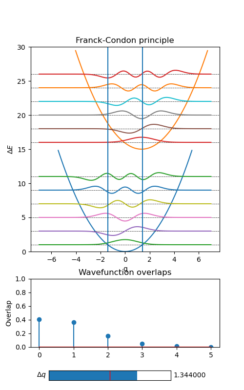

# franckcondon

Franck-Condon principle for two (displaced) harmonic oscillators.

Please see [10.1002/ciuz.201100547](http://dx.doi.org/10.1002%2Fciuz.201100547) (in German) or [10.1002/cphc.201600243](https://doi.org/10.1002/cphc.201600243) (in English) for a discussion.

Requires matplotlib, numpy and scipy. Execute with:

```
    python franckcondon.py
```


